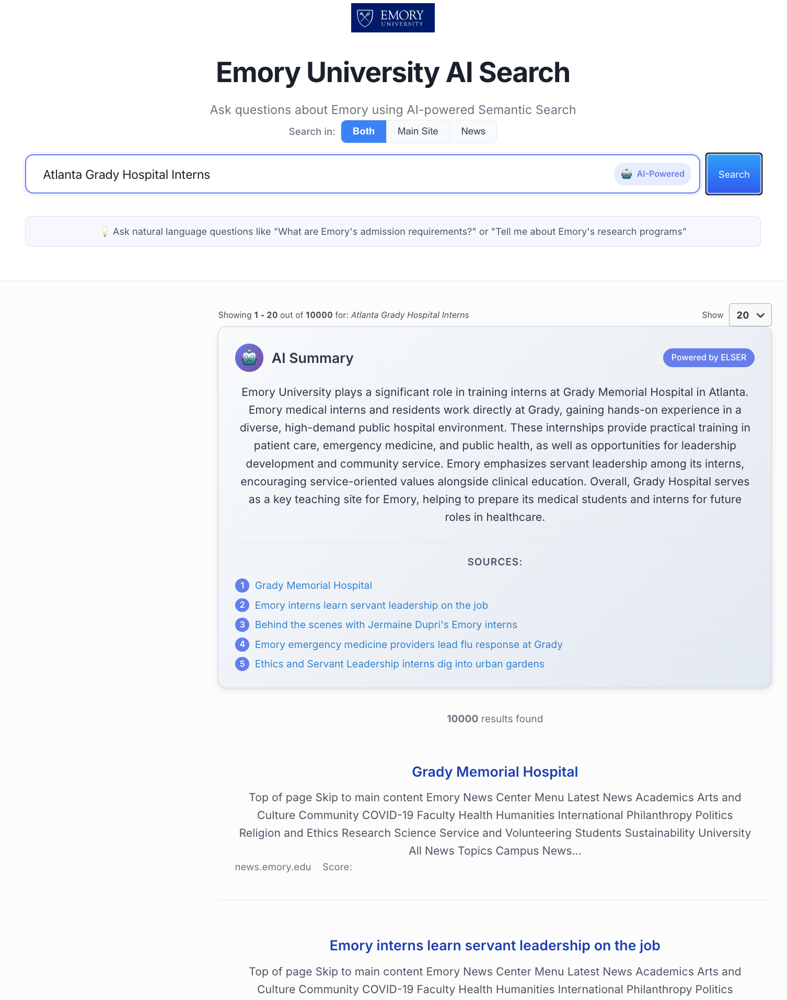

# Emory Search - Elastic Search UI

A modern, responsive search interface for Emory University content, powered by Elasticsearch and built with the official Elastic Search UI library.

## 📸 Demo



*AI-powered semantic search interface with ELSER technology, featuring natural language queries and intelligent result summaries.*

## 🚀 Quick Start

### 1. Install Dependencies
```bash
npm install
```

### 2. Configure Environment
```bash
cp env.example .env
```

Edit `.env` with your Elasticsearch configuration:
```env
VITE_ELASTICSEARCH_ENDPOINT=https://your-deployment.es.us-east-1.aws.cloud.es.io
VITE_ELASTICSEARCH_API_KEY=your_api_key_here

# Behavioral Analytics (optional)
VITE_ANALYTICS_COLLECTION_NAME=emory-search-analytics
VITE_ANALYTICS_ENABLED=true
VITE_ANALYTICS_DEBUG=false
```

### 3. Start Development Server
```bash
npm run dev
```

The application will be available at `http://localhost:3000`

## 🏗️ Architecture

This application uses a **direct connection** to Elasticsearch with no backend required:

```
┌─────────────────┐    Direct Connection    ┌─────────────────┐
│   React Frontend │ ◄─────────────────────► │ Elasticsearch    │
│   (Port 3000)    │                         │   Cloud          │
└─────────────────┘                         └─────────────────┘
```

## 📦 Dependencies

- **React 18** - Modern React with hooks
- **TypeScript** - Type-safe development
- **Vite** - Fast build tool and dev server
- **Elastic Search UI** - Official Elasticsearch search interface
- **Elasticsearch Connector** - Direct Elasticsearch connection

## 🎯 Features

### 🎨 Modern UI Design
- **Clean, minimalist interface** inspired by modern search engines
- **Emory University branding** with logo placement
- **Responsive design** that works on all devices
- **Professional color scheme** with blue gradient header

### 🔍 Search Capabilities
- **AI-Powered ELSER Search** using Elasticsearch's semantic search model
- **Natural Language Queries** - Ask questions like "What are Emory's admission requirements?"
- **Multi-Index Support** across both `search-emory-main` and `search-emory-news` indices
- **No Search-as-You-Type** - Optimized for complete, thoughtful questions

### 🏷️ Faceted Search
- **Content Type** - Filter between Main Site and News content
- **Built-in filtering** with Search UI components

### 📄 Results Management
- **Pagination** with configurable page sizes
- **Sorting** by relevance
- **Result highlighting** for search terms

### 📊 Behavioral Analytics
- **Search Tracking** - Monitor user search patterns and queries
- **Click Analytics** - Track result clicks and user engagement
- **GDPR Compliant** - Anonymous tracking with no personal data
- **Real-time Insights** - View analytics in Kibana dashboards
- **Custom Events** - Track search modes, index selection, and more

### 🤖 AI-Powered Summaries
- **ELSER Integration** - AI summaries for all search results
- **Natural Language Queries** - Optimized for conversational search
- **Source Citations** - Links back to original content
- **Extractive Summarization** - Works without external AI services
- **Contextual Answers** - Provides comprehensive responses to user questions
- **Click tracking** for analytics

### 🎨 Custom Result Display
Each result shows:
- **Title** with clickable link
- **Content type** (Main Site or News)
- **Date** when content was last crawled
- **Body content** preview
- **Meta keywords** as tags

## 🔧 Configuration

### Search Fields
The application searches across these fields:
```javascript
search_fields: {
  title: {},
  body_content: {}
}
```

### Result Fields
Displays these fields from Elasticsearch:
```javascript
result_fields: {
  title: { raw: {} },
  body_content: { raw: {} },
  url: { raw: {} },
  meta_keywords: { raw: {} },
  last_crawled_at: { raw: {} },
  domains: { raw: {} },
  url_host: { raw: {} },
  _index: { raw: {} }
}
```

## 🛠️ Development

### Available Scripts
- `npm run dev` - Start development server
- `npm run build` - Build for production
- `npm run preview` - Preview production build
- `npm run lint` - Run ESLint
- `npm run lint:fix` - Fix ESLint issues

### Project Structure
```
emory-search/
├── src/
│   ├── App.tsx          # Main application component
│   ├── App.css          # Custom styles
│   ├── main.tsx         # React entry point
│   └── index.css        # Global styles
├── public/              # Static assets
│   ├── emory-logo.png   # Emory University logo (add here)
│   └── README.md        # Logo placement instructions
├── package.json         # Dependencies and scripts
├── vite.config.js       # Vite configuration
├── tsconfig.json        # TypeScript configuration
└── README.md           # This file
```

## 🚀 Deployment

### Production Build
```bash
npm run build
```

The built files will be in the `dist/` directory, ready for deployment to any static hosting service.

### Logo Setup
Before deployment, add the Emory University logo:
1. **Place logo file** in `public/emory-logo.png`
2. **Recommended size**: 120px × 60px (or similar aspect ratio)
3. **Format**: PNG with transparent background preferred
4. **Test locally** to ensure the logo displays correctly

### Environment Variables
For production deployment, set these environment variables:
- `VITE_ELASTICSEARCH_ENDPOINT` - Your Elasticsearch endpoint
- `VITE_ELASTICSEARCH_API_KEY` - Your Elasticsearch API key

## 🔒 Security

### Development
- Uses `ElasticsearchAPIConnector` for direct connection
- API key is exposed to browser (fine for development)

### Production
For production deployment, consider using:
- `ApiProxyConnector` with a proxy server
- Server-side API key management
- CORS configuration for your domain

## 📊 Elasticsearch Indices

The application searches across two indices:
- **`search-emory-main`** - Main Emory University website content
- **`search-emory-news`** - News and announcements content

## 📚 Documentation

### Behavioral Analytics Setup
For detailed instructions on setting up and using Behavioral Analytics, see:
- **[BEHAVIORAL_ANALYTICS_SETUP.md](./BEHAVIORAL_ANALYTICS_SETUP.md)** - Complete setup guide
- **[Elastic Behavioral Analytics Docs](https://www.elastic.co/guide/en/elasticsearch/reference/8.18/behavioral-analytics-overview.html)** - Official documentation

### Additional Resources
- **AI Summary Setup**: See `AI_SUMMARY_SETUP.md` for AI summary configuration
- **Production Deployment**: See `PRODUCTION_DEPLOYMENT.md` for deployment instructions
- **Search UI Documentation**: [Elastic Search UI](https://docs.elastic.co/search-ui/overview)
- **Elasticsearch Reference**: [Official Elasticsearch Docs](https://www.elastic.co/guide/en/elasticsearch/reference/current/index.html)

## 🤝 Contributing

1. Fork the repository
2. Create a feature branch
3. Make your changes
4. Test thoroughly
5. Submit a pull request

## 📄 License

MIT License - see LICENSE file for details. 